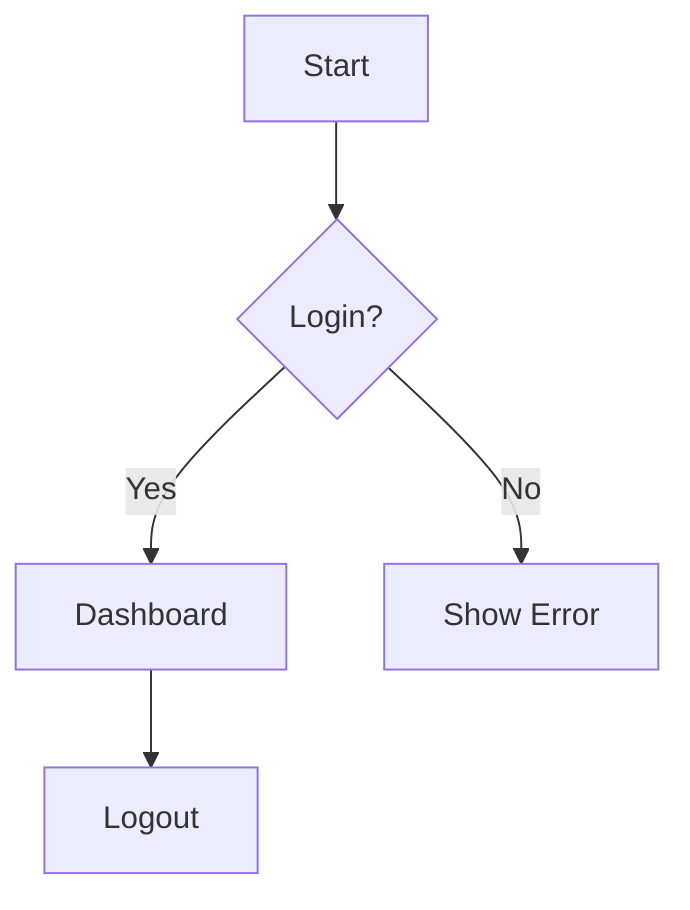
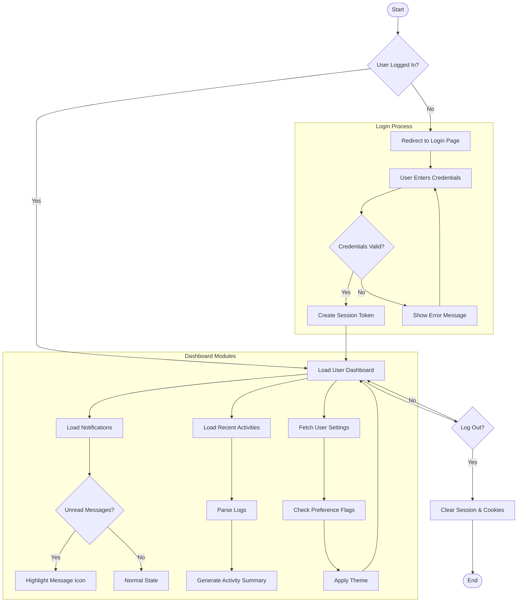
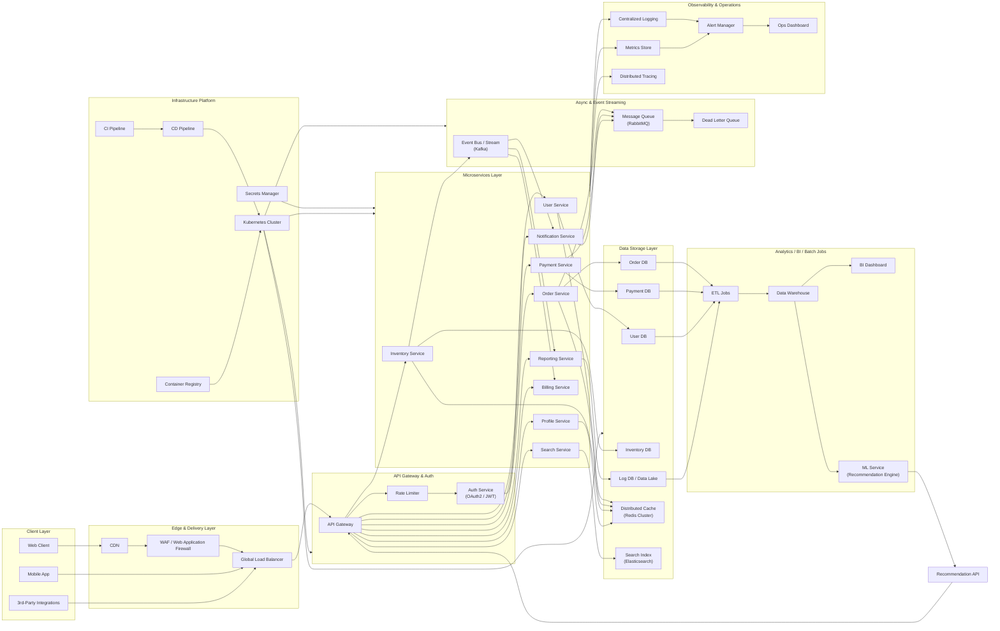

# Markdown 語法 效果 與 語法 對照表
# Markdown 語法 效果 與 語法 對照表

---

## 1️⃣ 粗體（Bold）
**粗體**
"**粗體**"

---

## 2️⃣ 斜體（Italic）
*斜體*
"*斜體*"

---

## 3️⃣ 粗斜體（Bold + Italic）
***粗斜體***
"***粗斜體***"

---

## 4️⃣ 標題（Headings）
# H1 標題
"# H1 標題"

## H2 標題
"## H2 標題"

### H3 標題
"### H3 標題"

#### H4 標題
"### H4 標題"
---

## 5️⃣ 無序清單（Bullet List）
- 項目 A
"- 項目 A"

- 項目 B
"- 項目 B"

---

## 6️⃣ 有序清單（Numbered List）
1. 步驟一
"1. 步驟一"

2. 步驟二
"2. 步驟二"

---

## 7️⃣ 引用（Blockquote）
> 這是一段引用
"> 這是一段引用"

---

## 8️⃣ 行內程式碼（Inline Code）
這是 `code`
"`code`"

---

## 9️⃣ 區塊程式碼（Code Block）

~~~python
print("Hello")
~~~

"
~~~python
print("Hello")
~~~
"

---

## 🔟 超連結（Link）
[Google](https://www.google.com)
"[Google](https://www.google.com)"

---

## 1️⃣1️⃣ 圖片（Image）

""

---

## 1️⃣2️⃣ 分隔線（Horizontal Rule）
---
"---"

---

## 1️⃣3️⃣ 表格（Table）
| 品項 | 價格 |
|------|------|
| 蘋果 | 30 |

"| 品項 | 價格 |
|------|------|
| 蘋果 | 30 |"

---

## 1️⃣4️⃣ 待辦清單（Task List）
- [ ] 未完成
"- [ ] 未完成"

- [x] 已完成
"- [x] 已完成"

---


| 左對齊 | 置中 | 右對齊 |
|:---|:---:|---:|
| Apple  | Banana | 30 |
| Orange | Kiwi   | 50 |


| 說明 |
|------|
| 第一行<br>第二行<br>第三行 |


| 指令 |
|------|
| `pip install numpy` |


| Python 範例 |
|-------------|
| <pre>def add(a, b):<br>    return a + b</pre> |


<table>
  <tr>
    <th colspan="2">合併兩欄</th>
  </tr>
  <tr>
    <td>A</td>
    <td>B</td>
  </tr>
</table>


<table>
  <tr>
    <td rowspan="2">合併兩行</td>
    <td>右 1</td>
  </tr>
  <tr>
    <td>右 2</td>
  </tr>
</table>


| Icon |
|------|
|  |


| 工具 | 連結 |
|------|------|
| ChatGPT | [點我](https://chat.openai.com) |


| 項目 | 說明 |
|:---:|---|
|  | 這是多行文字示範：<br>• 支援 `<br>`<br>• 可放圖片<br>• 可混合語法 |


# Advanced Markdown Showcase  
> A demonstration of what advanced Markdown formatting can achieve.

## 1. Introduction
Markdown is a lightweight markup language for writing documentation, notes, and web content.

---

## 2. Table of Contents
- [Introduction](#1-introduction)  
- [Table Example](#3-table-example)  
- [Code Blocks](#4-code-blocks)  
- [Quotes & Footnotes](#5-quotes--footnotes)  
- [To-Do List](#6-to-do-list)  
- [Collapsible Section](#7-collapsible-section)  
- [Mermaid Diagram](#8-mermaid-diagram)  

---

## 3. Table Example

| Feature            | Support | Notes |
|-------------------|---------|-------|
| **Bold / Italic** | ✔️      | Emphasis |
| **Tables**        | ✔️      | Useful for comparison |
| **Code Highlight**| ✔️      | Multi-language |
| **Collapsible**   | Partial | Platform-dependent |
| **Mermaid**       | Partial | Platform-dependent |

---

## 4. Code Blocks

### Python
```python
def fibonacci(n):
    seq = [0, 1]
    for i in range(2, n):
        seq.append(seq[-1] + seq[-2])
    return seq

print(fibonacci(10))
```

### Bash
```bash
#!/bin/bash
echo "Deploying project..."
git pull origin main
docker compose up -d
```

---

## 5. Quotes & Footnotes

> “Simplicity is the soul of wit.” — Shakespeare

This is a sentence with a footnote.[^1]

[^1]: Footnote content.

---

## 6. To-Do List
- [x] Create sample Markdown  
- [ ] Add images  
- [x] Add code blocks  
- [ ] Final review  

---

## 7. Collapsible Section

<details>
<summary>Click to expand</summary>

### Inside the collapsible block

- Supports **bold**, *italic*
- Supports code blocks:

```js
console.log("Inside collapsible block");
```

</details>

---

## 8. Mermaid Diagram


---

## 9. Conclusion
Markdown is flexible and powerful, especially with extended features.


## 8. Mermaid Diagram (Advanced)




---

## 8. Mermaid Diagram (Large-Scale System Architecture – GitHub Compatible)



