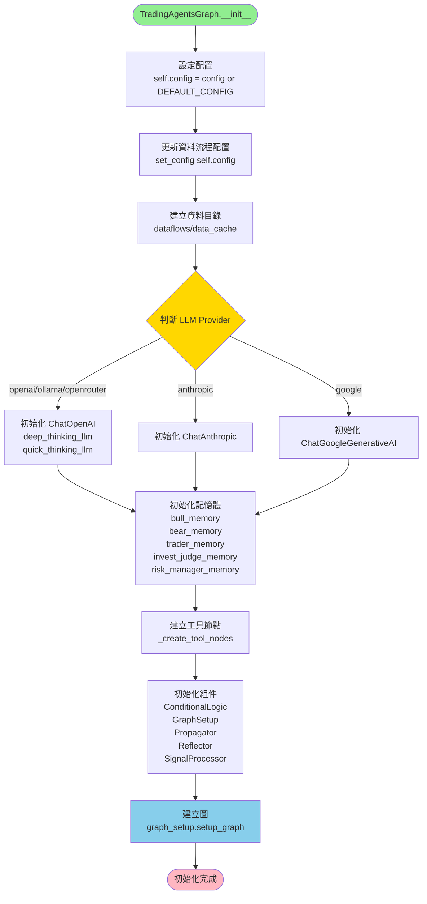
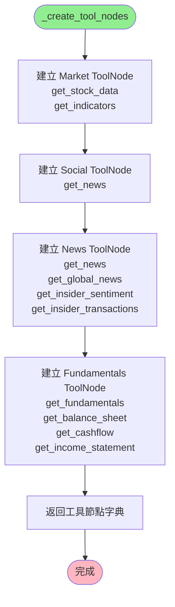
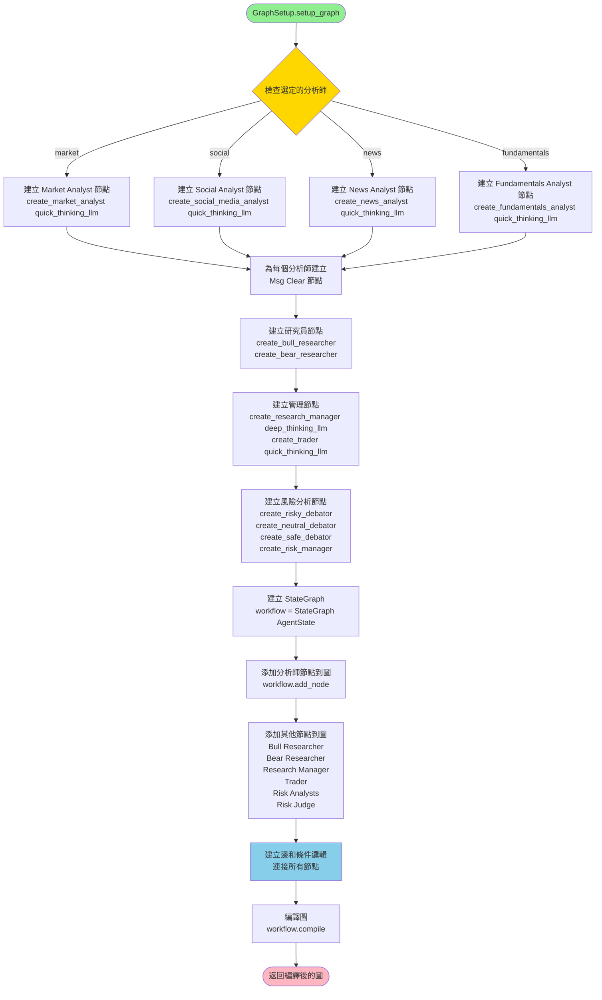
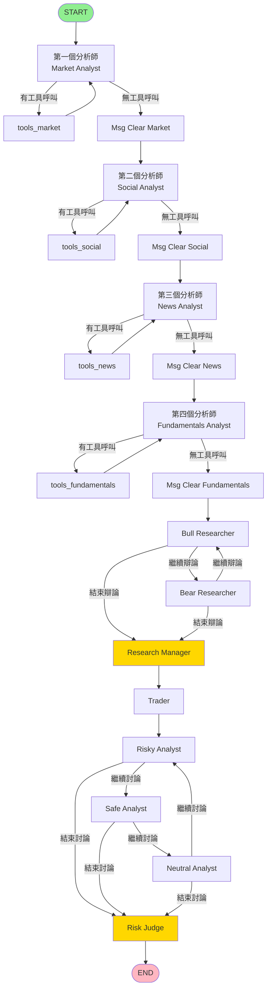
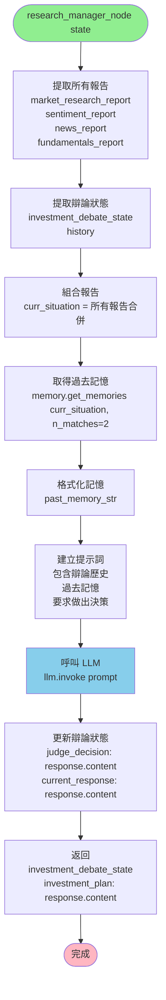
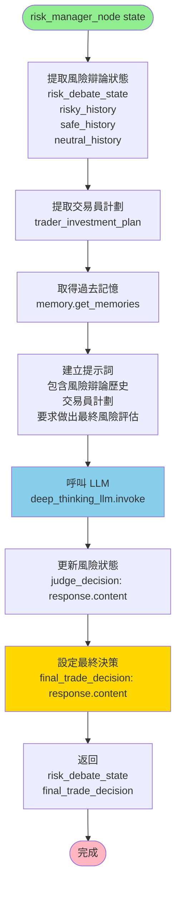
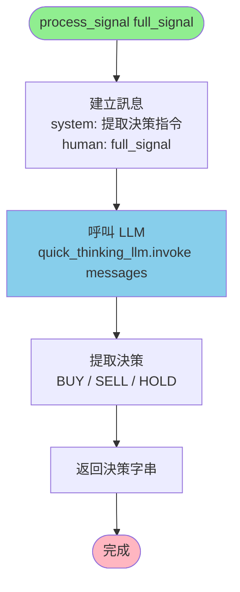
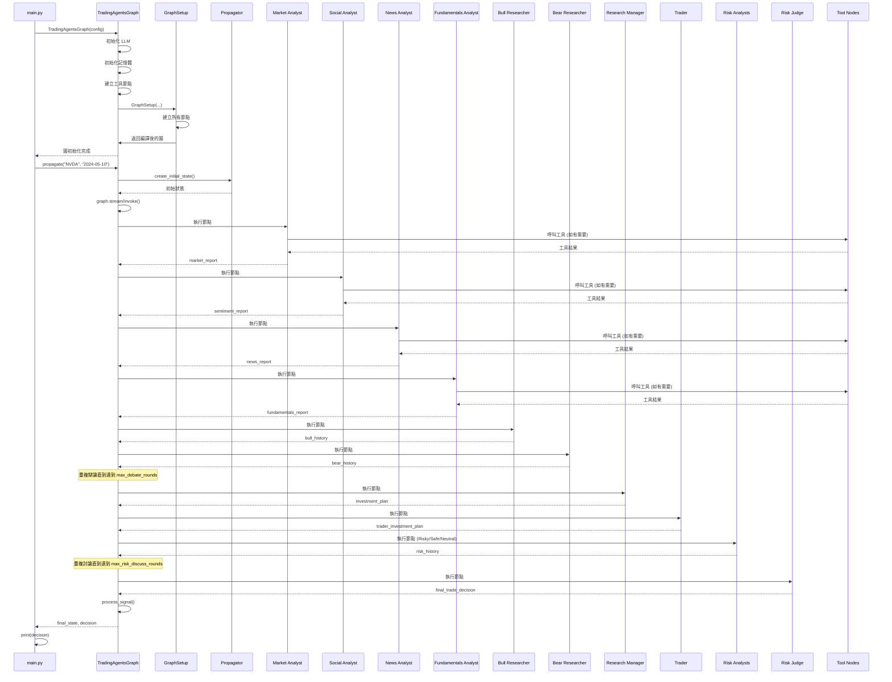

# TradingAgents 專案執行流程圖

本文檔詳細說明 TradingAgents 專案從程式啟動到產生交易決策的完整執行流程。

## 目錄
1. [整體執行流程](#整體執行流程)
2. [初始化階段](#初始化階段)
3. [圖建立階段](#圖建立階段)
4. [執行階段](#執行階段)
5. [分析師節點詳細流程](#分析師節點詳細流程)
6. [工具呼叫流程](#工具呼叫流程)
7. [決策流程](#決策流程)

---

## 整體執行流程

```mermaid
flowchart TD
    Start([main.py 開始執行]) --> LoadEnv[載入環境變數<br/>load_dotenv]
    LoadEnv --> CreateConfig[建立配置<br/>config = DEFAULT_CONFIG.copy]
    CreateConfig --> SetConfig[設定 LLM 和資料來源<br/>config["deep_think_llm"]<br/>config["data_vendors"]]
    SetConfig --> InitGraph[初始化 TradingAgentsGraph<br/>ta = TradingAgentsGraph]
    InitGraph --> Propagate[執行 propagate<br/>ta.propagate("NVDA", "2024-05-10")]
    Propagate --> ProcessResult[處理結果<br/>print decision]
    ProcessResult --> End([結束])
    
    style Start fill:#90EE90
    style End fill:#FFB6C1
    style InitGraph fill:#87CEEB
    style Propagate fill:#FFD700
```

---

## 初始化階段

### TradingAgentsGraph.__init__() 詳細流程



### _create_tool_nodes() 詳細流程



---

## 圖建立階段

### GraphSetup.setup_graph() 詳細流程



### 圖的節點連接結構



---

## 執行階段

### propagate() 詳細流程

```mermaid
flowchart TD
    Start([propagate company_name, trade_date]) --> SetTicker[設定 ticker<br/>self.ticker = company_name]
    SetTicker --> CreateInitState[建立初始狀態<br/>propagator.create_initial_state]
    
    CreateInitState --> GetGraphArgs[取得圖參數<br/>propagator.get_graph_args<br/>stream_mode: values<br/>recursion_limit: 100]
    
    GetGraphArgs --> CheckDebug{是否為 Debug 模式?}
    
    CheckDebug -->|是| StreamMode[串流模式執行<br/>graph.stream init_agent_state]
    CheckDebug -->|否| InvokeMode[直接執行<br/>graph.invoke init_agent_state]
    
    StreamMode --> ProcessChunks[處理每個 chunk<br/>chunk["messages"][-1].pretty_print<br/>trace.append chunk]
    ProcessChunks --> GetFinalState1[取得最終狀態<br/>final_state = trace[-1]]
    
    InvokeMode --> GetFinalState2[取得最終狀態<br/>final_state = graph.invoke result]
    
    GetFinalState1 --> StoreState
    GetFinalState2 --> StoreState
    
    StoreState[儲存當前狀態<br/>self.curr_state = final_state] --> LogState[記錄狀態<br/>_log_state trade_date, final_state]
    
    LogState --> ProcessSignal[處理信號<br/>process_signal final_state["final_trade_decision"]]
    
    ProcessSignal --> Return[返回 final_state, decision]
    Return --> End([完成])
    
    style Start fill:#90EE90
    style End fill:#FFB6C1
    style CheckDebug fill:#FFD700
    style ProcessSignal fill:#87CEEB
```

### create_initial_state() 詳細流程

```mermaid
flowchart TD
    Start([create_initial_state company_name, trade_date]) --> CreateState[建立初始狀態字典]
    
    CreateState --> SetMessages[設定 messages<br/>[("human", company_name)]]
    SetMessages --> SetCompany[設定 company_of_interest<br/>company_name]
    SetCompany --> SetTradeDate[設定 trade_date<br/>str trade_date]
    
    SetTradeDate --> CreateInvestDebateState[建立投資辯論狀態<br/>InvestDebateState<br/>history: ""<br/>current_response: ""<br/>count: 0]
    
    CreateInvestDebateState --> CreateRiskDebateState[建立風險辯論狀態<br/>RiskDebateState<br/>history: ""<br/>current_risky_response: ""<br/>current_safe_response: ""<br/>current_neutral_response: ""<br/>count: 0]
    
    CreateRiskDebateState --> InitReports[初始化報告欄位<br/>market_report: ""<br/>fundamentals_report: ""<br/>sentiment_report: ""<br/>news_report: ""]
    
    InitReports --> Return[返回完整狀態字典]
    Return --> End([完成])
    
    style Start fill:#90EE90
    style End fill:#FFB6C1
```

---

## 分析師節點詳細流程

### Market Analyst 節點執行流程

```mermaid
flowchart TD
    Start([market_analyst_node state]) --> ExtractState[從 state 提取<br/>current_date = state["trade_date"]<br/>ticker = state["company_of_interest"]]
    
    ExtractState --> DefineTools[定義工具<br/>tools = [get_stock_data, get_indicators]]
    
    DefineTools --> CreateSystemMessage[建立系統提示詞<br/>說明分析師角色和任務<br/>技術指標說明]
    
    CreateSystemMessage --> CreatePrompt[建立提示詞模板<br/>ChatPromptTemplate.from_messages]
    
    CreatePrompt --> PartialPrompt[填入變數<br/>prompt.partial system_message<br/>prompt.partial tool_names<br/>prompt.partial current_date<br/>prompt.partial ticker]
    
    PartialPrompt --> CreateChain[建立執行鏈<br/>chain = prompt | llm.bind_tools tools]
    
    CreateChain --> InvokeChain[執行鏈<br/>result = chain.invoke state["messages"]]
    
    InvokeChain --> CheckToolCalls{檢查是否有工具呼叫<br/>len result.tool_calls == 0?}
    
    CheckToolCalls -->|是| SetReport[設定報告<br/>report = result.content]
    CheckToolCalls -->|否| EmptyReport[report = ""<br/>將由工具節點處理]
    
    SetReport --> Return
    EmptyReport --> Return
    
    Return[返回<br/>messages: [result]<br/>market_report: report] --> End([完成])
    
    style Start fill:#90EE90
    style End fill:#FFB6C1
    style CheckToolCalls fill:#FFD700
    style CreateChain fill:#87CEEB
```

### Social Media Analyst 節點執行流程

```mermaid
flowchart TD
    Start([social_media_analyst_node state]) --> ExtractState[從 state 提取<br/>current_date = state["trade_date"]<br/>ticker = state["company_of_interest"]]
    
    ExtractState --> DefineTools[定義工具<br/>tools = [get_news]]
    
    DefineTools --> CreateSystemMessage[建立系統提示詞<br/>說明社交媒體分析師角色<br/>分析社交媒體、新聞、情緒]
    
    CreateSystemMessage --> CreatePrompt[建立提示詞模板<br/>ChatPromptTemplate.from_messages]
    
    CreatePrompt --> PartialPrompt[填入變數<br/>prompt.partial system_message<br/>prompt.partial tool_names<br/>prompt.partial current_date<br/>prompt.partial ticker]
    
    PartialPrompt --> CreateChain[建立執行鏈<br/>chain = prompt | llm.bind_tools tools]
    
    CreateChain --> InvokeChain[執行鏈<br/>result = chain.invoke state["messages"]]
    
    InvokeChain --> CheckToolCalls{檢查是否有工具呼叫<br/>len result.tool_calls == 0?}
    
    CheckToolCalls -->|是| SetReport[設定報告<br/>report = result.content]
    CheckToolCalls -->|否| EmptyReport[report = ""<br/>將由工具節點處理]
    
    SetReport --> Return
    EmptyReport --> Return
    
    Return[返回<br/>messages: [result]<br/>sentiment_report: report] --> End([完成])
    
    style Start fill:#90EE90
    style End fill:#FFB6C1
    style CheckToolCalls fill:#FFD700
```

---

## 工具呼叫流程

### 工具節點執行流程

```mermaid
flowchart TD
    Start([ToolNode 執行]) --> ReceiveToolCalls[接收工具呼叫<br/>從分析師節點的 result.tool_calls]
    
    ReceiveToolCalls --> ExtractToolCall[提取工具呼叫<br/>tool_call.name<br/>tool_call.args]
    
    ExtractToolCall --> RouteToVendor[路由到資料供應商<br/>route_to_vendor method, *args]
    
    RouteToVendor --> GetCategory[取得工具類別<br/>get_category_for_method method]
    
    GetCategory --> GetVendor[取得供應商配置<br/>get_vendor category, method]
    
    GetVendor --> CheckToolVendors{檢查工具級別配置<br/>tool_vendors[method]?}
    
    CheckToolVendors -->|有| UseToolVendor[使用工具級別配置]
    CheckToolVendors -->|無| UseCategoryVendor[使用類別級別配置]
    
    UseToolVendor --> GetVendorImpl
    UseCategoryVendor --> GetVendorImpl
    
    GetVendorImpl[取得供應商實作<br/>VENDOR_METHODS[method][vendor]] --> TryExecute[嘗試執行<br/>vendor_impl *args, **kwargs]
    
    TryExecute --> CheckSuccess{執行成功?}
    
    CheckSuccess -->|是| ReturnResult[返回結果]
    CheckSuccess -->|否| CheckFallback{有其他備用供應商?}
    
    CheckFallback -->|是| TryNextVendor[嘗試下一個供應商]
    TryNextVendor --> GetVendorImpl
    CheckFallback -->|否| RaiseError[拋出錯誤<br/>所有供應商都失敗]
    
    ReturnResult --> UpdateMessages[更新 messages<br/>將工具結果加入 state]
    UpdateMessages --> End([完成])
    
    style Start fill:#90EE90
    style End fill:#FFB6C1
    style CheckSuccess fill:#FFD700
    style CheckFallback fill:#FFD700
```

### route_to_vendor() 詳細流程

```mermaid
flowchart TD
    Start([route_to_vendor method, *args, **kwargs]) --> GetCategory[取得工具類別<br/>get_category_for_method method]
    
    GetCategory --> GetVendorConfig[取得供應商配置<br/>get_vendor category, method]
    
    GetVendorConfig --> ParseVendors[解析供應商列表<br/>primary_vendors = vendor_config.split]
    
    ParseVendors --> GetAvailableVendors[取得所有可用供應商<br/>all_available_vendors = VENDOR_METHODS[method].keys]
    
    GetAvailableVendors --> CreateFallbackList[建立備用列表<br/>fallback_vendors = primary + remaining]
    
    CreateFallbackList --> LoopVendors[迴圈處理每個供應商]
    
    LoopVendors --> CheckVendorSupported{供應商是否支援?}
    
    CheckVendorSupported -->|否| NextVendor[下一個供應商]
    CheckVendorSupported -->|是| GetImpl[取得實作函數<br/>vendor_impl = VENDOR_METHODS[method][vendor]]
    
    GetImpl --> CheckImplType{實作類型?}
    
    CheckImplType -->|單一函數| CallSingle[呼叫單一函數<br/>vendor_impl *args, **kwargs]
    CheckImplType -->|函數列表| CallMultiple[迴圈呼叫多個函數<br/>for impl in vendor_impl]
    
    CallSingle --> TryCatch[try-except 錯誤處理]
    CallMultiple --> TryCatch
    
    TryCatch --> CheckResult{有結果?}
    
    CheckResult -->|是| AddResult[加入結果列表<br/>results.append result]
    CheckResult -->|否| NextVendor
    
    AddResult --> CheckSingleVendor{單一供應商配置?}
    
    CheckSingleVendor -->|是| BreakLoop[跳出迴圈]
    CheckSingleVendor -->|否| NextVendor
    
    NextVendor --> LoopVendors
    
    BreakLoop --> CheckResults{results 為空?}
    
    CheckResults -->|是| RaiseError[拋出錯誤<br/>所有供應商都失敗]
    CheckResults -->|否| ReturnResult[返回結果<br/>單一結果或合併字串]
    
    RaiseError --> End
    ReturnResult --> End([完成])
    
    style Start fill:#90EE90
    style End fill:#FFB6C1
    style CheckVendorSupported fill:#FFD700
    style CheckResult fill:#FFD700
```

---

## 決策流程

### Research Manager 節點流程



### Trader 節點流程

```mermaid
flowchart TD
    Start([trader_node state]) --> ExtractData[提取資料<br/>company_name<br/>investment_plan<br/>所有分析師報告]
    
    ExtractData --> CombineSituation[組合當前情況<br/>curr_situation = 所有報告合併]
    
    CombineSituation --> GetMemories[取得過去記憶<br/>memory.get_memories curr_situation, n_matches=2]
    
    GetMemories --> FormatMemories[格式化記憶<br/>past_memory_str]
    
    FormatMemories --> CreateContext[建立上下文<br/>包含投資計劃<br/>公司名稱]
    
    CreateContext --> CreateMessages[建立訊息<br/>system: 交易員角色說明<br/>user: 投資計劃和上下文]
    
    CreateMessages --> InvokeLLM[呼叫 LLM<br/>llm.invoke messages]
    
    InvokeLLM --> Return[返回<br/>messages: [result]<br/>trader_investment_plan: result.content]
    
    Return --> End([完成])
    
    style Start fill:#90EE90
    style End fill:#FFB6C1
    style InvokeLLM fill:#87CEEB
```

### Risk Judge 節點流程



### Signal Processing 流程



---

## 條件邏輯流程

### should_continue_* 函數流程

```mermaid
flowchart TD
    Start([should_continue_analyst state]) --> GetLastMessage[取得最後一條訊息<br/>last_message = messages[-1]]
    
    GetLastMessage --> CheckToolCalls{檢查是否有工具呼叫<br/>last_message.tool_calls?}
    
    CheckToolCalls -->|有| ReturnTools[返回 "tools_analyst"<br/>需要執行工具]
    CheckToolCalls -->|無| ReturnClear[返回 "Msg Clear Analyst"<br/>清理訊息繼續]
    
    ReturnTools --> End
    ReturnClear --> End([完成])
    
    style Start fill:#90EE90
    style End fill:#FFB6C1
    style CheckToolCalls fill:#FFD700
```

### should_continue_debate 流程

```mermaid
flowchart TD
    Start([should_continue_debate state]) --> CheckCount[檢查辯論次數<br/>count >= 2 * max_debate_rounds?]
    
    CheckCount -->|是| ReturnManager[返回 "Research Manager"<br/>結束辯論]
    CheckCount -->|否| CheckLastSpeaker[檢查最後發言者<br/>current_response.startswith "Bull"?]
    
    CheckLastSpeaker -->|是| ReturnBear[返回 "Bear Researcher"<br/>輪到熊市研究員]
    CheckLastSpeaker -->|否| ReturnBull[返回 "Bull Researcher"<br/>輪到牛市研究員]
    
    ReturnManager --> End
    ReturnBear --> End
    ReturnBull --> End([完成])
    
    style Start fill:#90EE90
    style End fill:#FFB6C1
    style CheckCount fill:#FFD700
    style CheckLastSpeaker fill:#FFD700
```

### should_continue_risk_analysis 流程

```mermaid
flowchart TD
    Start([should_continue_risk_analysis state]) --> CheckCount[檢查討論次數<br/>count >= 3 * max_risk_discuss_rounds?]
    
    CheckCount -->|是| ReturnJudge[返回 "Risk Judge"<br/>結束討論]
    CheckCount -->|否| CheckLastSpeaker[檢查最後發言者<br/>latest_speaker]
    
    CheckLastSpeaker -->|Risky| ReturnSafe[返回 "Safe Analyst"]
    CheckLastSpeaker -->|Safe| ReturnNeutral[返回 "Neutral Analyst"]
    CheckLastSpeaker -->|Neutral| ReturnRisky[返回 "Risky Analyst"]
    
    ReturnJudge --> End
    ReturnSafe --> End
    ReturnNeutral --> End
    ReturnRisky --> End([完成])
    
    style Start fill:#90EE90
    style End fill:#FFB6C1
    style CheckCount fill:#FFD700
    style CheckLastSpeaker fill:#FFD700
```

---

## 完整執行時序圖



---

## 關鍵檔案與函數對照表

| 階段 | 檔案 | 主要函數/類別 | 功能 |
|------|------|-------------|------|
| 入口 | `main.py` | - | 程式入口點 |
| 初始化 | `tradingagents/graph/trading_graph.py` | `TradingAgentsGraph.__init__` | 初始化圖和所有組件 |
| 圖建立 | `tradingagents/graph/setup.py` | `GraphSetup.setup_graph` | 建立和連接所有節點 |
| 狀態管理 | `tradingagents/graph/propagation.py` | `Propagator.create_initial_state` | 建立初始狀態 |
| 執行 | `tradingagents/graph/trading_graph.py` | `TradingAgentsGraph.propagate` | 執行圖並取得結果 |
| 條件邏輯 | `tradingagents/graph/conditional_logic.py` | `ConditionalLogic.*` | 決定節點流向 |
| 信號處理 | `tradingagents/graph/signal_processing.py` | `SignalProcessor.process_signal` | 處理最終決策 |
| 市場分析 | `tradingagents/agents/analysts/market_analyst.py` | `create_market_analyst` | 技術分析 |
| 社交分析 | `tradingagents/agents/analysts/social_media_analyst.py` | `create_social_media_analyst` | 社交媒體分析 |
| 新聞分析 | `tradingagents/agents/analysts/news_analyst.py` | `create_news_analyst` | 新聞分析 |
| 基本面分析 | `tradingagents/agents/analysts/fundamentals_analyst.py` | `create_fundamentals_analyst` | 基本面分析 |
| 研究管理 | `tradingagents/agents/managers/research_manager.py` | `create_research_manager` | 綜合研究決策 |
| 交易員 | `tradingagents/agents/trader/trader.py` | `create_trader` | 交易決策 |
| 風險管理 | `tradingagents/agents/managers/risk_manager.py` | `create_risk_manager` | 風險評估 |
| 資料路由 | `tradingagents/dataflows/interface.py` | `route_to_vendor` | 路由到資料供應商 |

---

## 總結

本流程圖詳細說明了 TradingAgents 專案的完整執行流程，從程式啟動、初始化、圖建立、節點執行到最終決策產生的每個步驟。每個階段都包含詳細的函數呼叫和資料流向，方便理解整個系統的運作機制。

