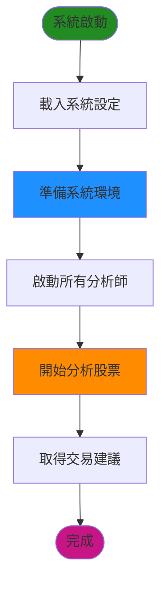
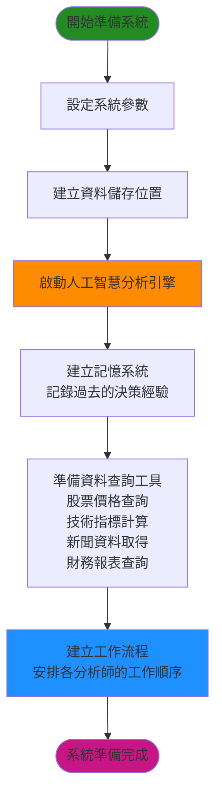
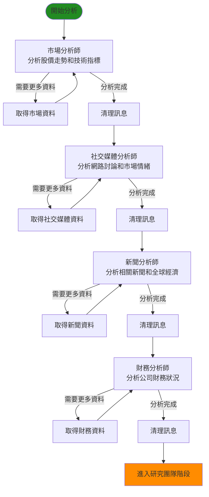
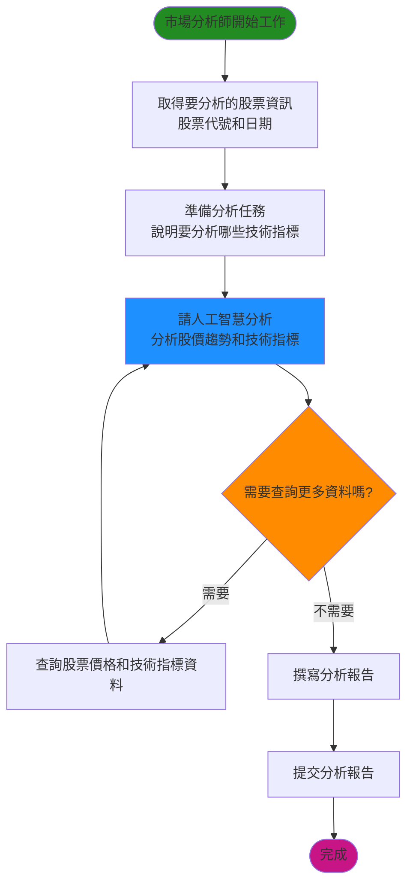
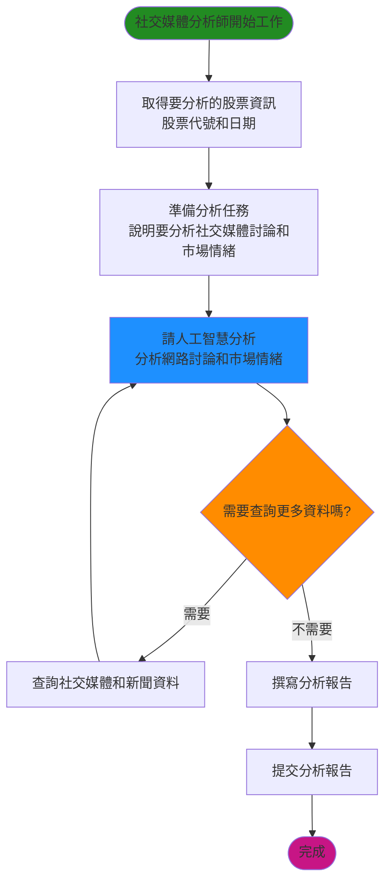
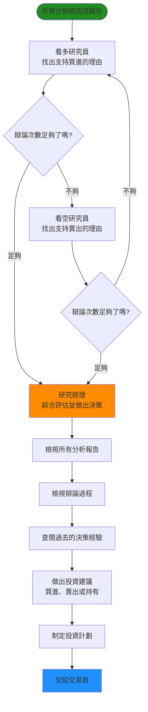
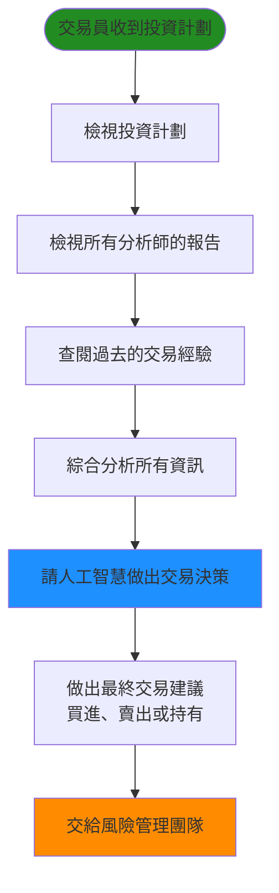
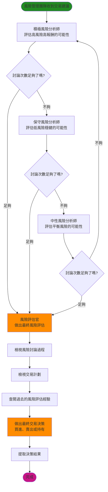
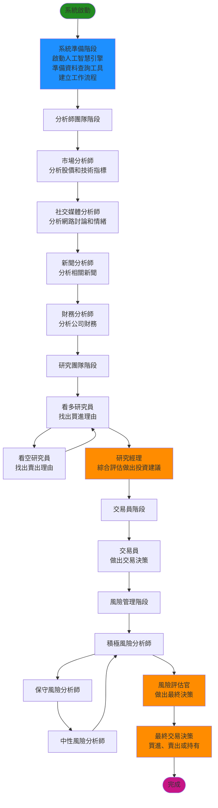

# TradingAgents 交易決策系統流程圖（簡化版）

本文檔以簡單易懂的方式說明交易決策系統如何運作，從開始到產生最終交易建議的完整流程。

## 目錄
1. [整體運作流程](#整體運作流程)
2. [系統準備階段](#系統準備階段)
3. [分析師團隊工作流程](#分析師團隊工作流程)
4. [研究與決策流程](#研究與決策流程)
5. [風險評估流程](#風險評估流程)
6. [完整工作流程圖](#完整工作流程圖)

---

## 整體運作流程

---

## 系統準備階段

### 系統初始化流程

---

## 分析師團隊工作流程

### 分析師團隊完整流程

### 市場分析師工作流程

### 社交媒體分析師工作流程

---

## 研究與決策流程

### 研究團隊辯論流程

### 交易員決策流程

---

## 風險評估流程

### 風險管理團隊討論流程

---

## 完整工作流程圖

### 系統完整運作流程

---

## 系統運作說明

### 第一階段：分析師團隊
系統會依序啟動四位專業分析師：
1. **市場分析師**：分析股票價格走勢和技術指標（如移動平均線、MACD、RSI等）
2. **社交媒體分析師**：分析網路上的討論、市場情緒和相關新聞
3. **新聞分析師**：分析全球經濟新聞和公司相關新聞
4. **財務分析師**：分析公司的財務報表、資產負債表、現金流等

每位分析師完成分析後，會提交一份詳細的報告。

### 第二階段：研究團隊辯論
兩位研究員會根據分析師的報告進行辯論：
- **看多研究員**：專注找出支持買進的理由
- **看空研究員**：專注找出支持賣出的理由

他們會來回辯論，直到達到設定的辯論次數。最後由**研究經理**綜合所有資訊，做出投資建議並制定投資計劃。

### 第三階段：交易員決策
**交易員**會檢視研究經理的投資計劃和所有分析報告，結合過去的交易經驗，做出交易決策。

### 第四階段：風險管理
三位風險分析師會評估交易建議的風險：
- **積極風險分析師**：評估高風險高報酬的可能性
- **保守風險分析師**：評估低風險穩健的可能性
- **中性風險分析師**：評估平衡風險的可能性

他們會來回討論，最後由**風險評估官**做出最終的風險評估和交易決策。

### 最終結果
系統會產出最終的交易建議：**買進（BUY）**、**賣出（SELL）** 或 **持有（HOLD）**。

---

## 系統特色

1. **多角度分析**：從技術面、情緒面、新聞面、財務面全面分析
2. **辯論機制**：透過研究員的辯論，確保決策的全面性
3. **風險控制**：透過風險管理團隊的討論，確保決策的安全性
4. **經驗學習**：系統會記住過去的決策經驗，持續改進
5. **自動化流程**：所有分析師和決策者都是人工智慧，可以自動運作

---

## 總結

這個交易決策系統就像一個完整的投資團隊，有專門的分析師負責不同領域的分析，有研究員進行辯論，有交易員做出決策，還有風險管理團隊進行把關。整個過程都是自動化的，最終會產出一個明確的交易建議。

