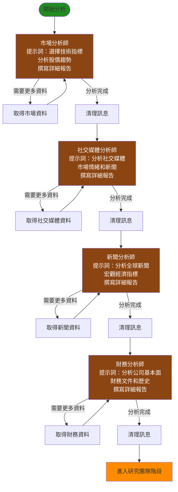
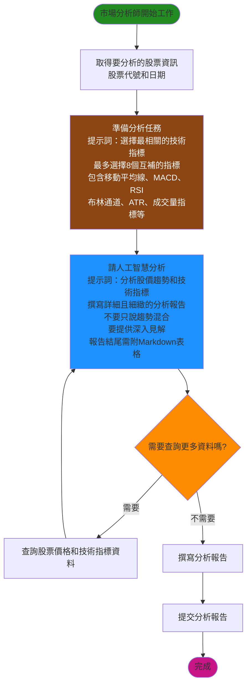
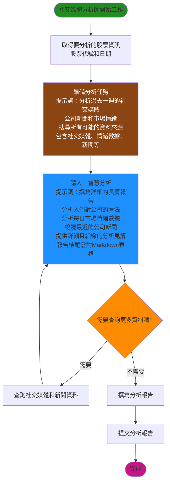
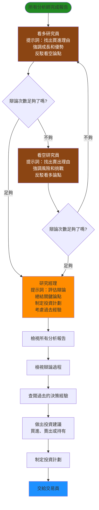
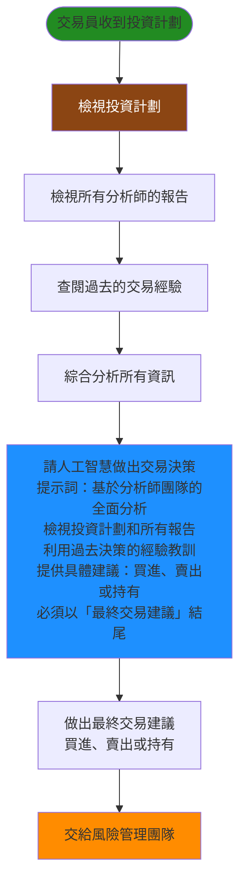
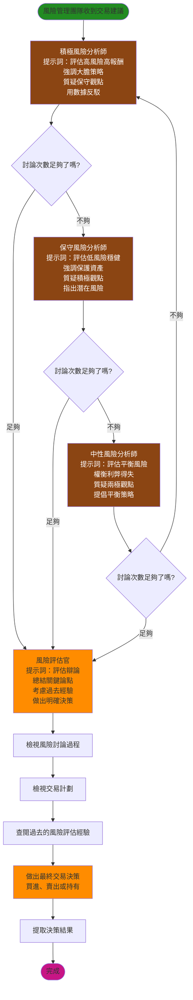
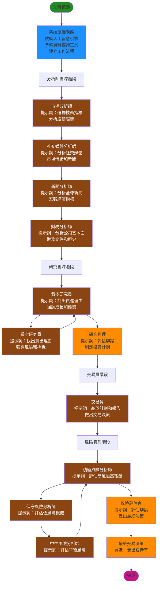

# TradingAgents 交易決策系統流程圖（簡化版）

本文檔以簡單易懂的方式說明交易決策系統如何運作，從開始到產生最終交易建議的完整流程。

## 目錄
1. [整體運作流程](#整體運作流程)
2. [系統準備階段](#系統準備階段)
3. [分析師團隊工作流程](#分析師團隊工作流程)
4. [研究與決策流程](#研究與決策流程)
5. [風險評估流程](#風險評估流程)
6. [完整工作流程圖](#完整工作流程圖)
7. [各角色提示詞摘要](#各角色提示詞摘要)
8. [系統運作說明](#系統運作說明)

---

## 整體運作流程

---

## 系統準備階段

### 系統初始化流程

---

## 分析師團隊工作流程

### 分析師團隊完整流程

### 市場分析師工作流程

### 社交媒體分析師工作流程

---

## 研究與決策流程

### 研究團隊辯論流程

### 交易員決策流程

---

## 風險評估流程

### 風險管理團隊討論流程

---

## 完整工作流程圖

### 系統完整運作流程

---

## 各角色提示詞摘要

### 分析師團隊提示詞

#### 市場分析師
- **角色定位**：交易助理，負責分析金融市場
- **主要任務**：
  - 從多種技術指標中選擇最相關的指標（最多8個）
  - 指標類型：移動平均線（50 SMA、200 SMA、10 EMA）、MACD相關、RSI、布林通道、ATR、成交量指標
  - 選擇互補且不重複的指標
  - 先取得股票資料，再使用指標進行分析
- **報告要求**：
  - 撰寫詳細且細緻的分析報告
  - 不要只說趨勢混合，要提供深入見解
  - 報告結尾需附Markdown表格整理重點
- **協作說明**：與其他助理協作，使用提供的工具完成任務

#### 社交媒體分析師
- **角色定位**：社交媒體和公司特定新聞研究員/分析師
- **主要任務**：
  - 分析過去一週的社交媒體貼文、公司新聞和市場情緒
  - 搜尋所有可能的資料來源（社交媒體、情緒數據、新聞）
  - 分析人們對公司的看法和每日市場情緒數據
- **報告要求**：
  - 撰寫詳細的長篇報告
  - 提供詳細且細緻的分析見解，幫助交易者決策
  - 報告結尾需附Markdown表格整理重點
- **工具使用**：使用get_news工具搜尋公司特定新聞和社交媒體討論

#### 新聞分析師
- **角色定位**：新聞研究員
- **主要任務**：
  - 分析過去一週的新聞和趨勢
  - 分析全球經濟和宏觀經濟指標
  - 分析與交易和宏觀經濟相關的當前世界狀況
- **報告要求**：
  - 撰寫詳細報告
  - 提供詳細且細緻的分析見解
  - 報告結尾需附Markdown表格整理重點
- **工具使用**：使用get_news搜尋公司特定新聞，使用get_global_news取得宏觀經濟新聞

#### 財務分析師
- **角色定位**：研究員，負責分析基本面資訊
- **主要任務**：
  - 分析過去一週的公司基本面資訊
  - 分析財務文件、公司簡介、基本財務數據、財務歷史
  - 全面了解公司的基本面資訊
- **報告要求**：
  - 撰寫詳細報告，包含盡可能多的細節
  - 提供詳細且細緻的分析見解
  - 報告結尾需附Markdown表格整理重點
- **工具使用**：使用get_fundamentals進行全面公司分析，使用get_balance_sheet、get_cashflow、get_income_statement取得特定財務報表

### 研究團隊提示詞

#### 看多研究員
- **角色定位**：看多分析師，主張投資該股票
- **主要任務**：
  - 建立強有力的證據基礎，強調成長潛力、競爭優勢、正面市場指標
  - 反駁看空論點，用數據和推理進行有效辯論
  - 直接回應看空研究員的論點
- **辯論風格**：用對話風格進行辯論，直接參與辯論而非只是列出數據
- **學習要求**：必須處理反思並從過去的經驗教訓中學習

#### 看空研究員
- **角色定位**：看空分析師，主張不投資該股票
- **主要任務**：
  - 提出有充分理由的論點，強調風險、挑戰、負面市場指標
  - 反駁看多論點，用數據和推理進行有效辯論
  - 直接回應看多研究員的論點
- **辯論風格**：用對話風格進行辯論，直接參與辯論而非只是列出事實
- **學習要求**：必須處理反思並從過去的經驗教訓中學習

#### 研究經理
- **角色定位**：投資組合經理和辯論促進者
- **主要任務**：
  - 評估辯論並做出明確決策：支持看空分析師、看多分析師，或選擇持有（僅在有強烈理由時）
  - 總結雙方關鍵論點，專注於最有力的證據或推理
  - 制定詳細投資計劃，包含建議、理由、戰略行動
- **決策要求**：
  - 建議必須明確且可執行（買進、賣出或持有）
  - 避免預設為持有，必須基於辯論中最強論點做出明確決策
  - 考慮過去的錯誤經驗，改進決策
- **報告風格**：用對話方式呈現分析，不使用特殊格式

### 交易員提示詞

- **角色定位**：交易代理，分析市場數據做出投資決策
- **主要任務**：
  - 基於分析師團隊的全面分析做出決策
  - 檢視投資計劃和所有分析報告
  - 利用過去決策的經驗教訓
- **決策要求**：
  - 提供具體建議：買進、賣出或持有
  - 必須以「最終交易建議：買進/賣出/持有」結尾確認建議
  - 不要忘記利用過去決策的經驗教訓
- **學習要求**：從類似情況的反思和經驗教訓中學習

### 風險管理團隊提示詞

#### 積極風險分析師
- **角色定位**：積極風險分析師，主張高報酬高風險機會
- **主要任務**：
  - 評估高風險高報酬的可能性
  - 強調大膽策略和競爭優勢
  - 質疑保守和中性觀點，用數據反駁對立觀點
- **辯論風格**：直接回應每個論點，用數據驅動的反駁和說服性推理進行辯論
- **重點**：強調潛在上漲空間，質疑對手的謹慎可能錯過關鍵機會

#### 保守風險分析師
- **角色定位**：保守/安全風險分析師，優先保護資產
- **主要任務**：
  - 評估低風險穩健的可能性
  - 強調保護資產、最小化波動、確保穩定成長
  - 質疑積極和中性觀點，指出潛在威脅和風險
- **辯論風格**：質疑對手的樂觀，強調他們可能忽略的潛在缺點
- **重點**：強調可持續性，展示低風險策略的優勢

#### 中性風險分析師
- **角色定位**：中性風險分析師，提供平衡觀點
- **主要任務**：
  - 評估平衡風險的可能性
  - 權衡利弊得失，評估市場趨勢和經濟變化
  - 質疑積極和保守觀點，提倡平衡策略
- **辯論風格**：分析雙方，指出積極和保守論點的弱點
- **重點**：展示平衡風險策略如何提供兩全其美的方案

#### 風險評估官
- **角色定位**：風險管理評估官和辯論促進者
- **主要任務**：
  - 評估三位風險分析師的辯論
  - 總結關鍵論點，專注於與情境最相關的論點
  - 提供理由，用辯論中的直接引用和反駁支持建議
  - 改進交易員的計劃，基於分析師的見解調整
- **決策要求**：
  - 必須產生明確建議：買進、賣出或持有
  - 選擇持有必須有強烈理由，不能只是因為各方都有有效論點
  - 考慮過去的錯誤經驗，確保不會做出錯誤的買進/賣出/持有決策而虧損
- **學習要求**：從過去的錯誤中學習，持續改進

---

## 系統運作說明

### 第一階段：分析師團隊
系統會依序啟動四位專業分析師，每位分析師都有特定的提示詞指導他們的工作：

1. **市場分析師**：
   - **提示詞重點**：選擇最相關的技術指標（最多8個），包含移動平均線、MACD、RSI、布林通道、ATR、成交量指標等
   - **任務**：分析股票價格走勢和技術指標，撰寫詳細且細緻的分析報告，報告結尾需附Markdown表格整理重點
   - **要求**：不要只說趨勢混合，要提供深入見解幫助交易者決策

2. **社交媒體分析師**：
   - **提示詞重點**：分析過去一週的社交媒體貼文、公司新聞和市場情緒
   - **任務**：搜尋所有可能的資料來源（社交媒體、情緒數據、新聞），撰寫詳細的長篇報告
   - **要求**：分析人們對公司的看法、每日市場情緒數據、最近的公司新聞，報告結尾需附Markdown表格

3. **新聞分析師**：
   - **提示詞重點**：分析過去一週的新聞和趨勢，關注全球經濟和宏觀經濟指標
   - **任務**：分析公司相關新聞和全球經濟新聞，撰寫詳細報告
   - **要求**：提供詳細且細緻的分析見解，報告結尾需附Markdown表格

4. **財務分析師**：
   - **提示詞重點**：分析公司基本面資訊，包含財務文件、公司簡介、基本財務數據、財務歷史
   - **任務**：分析公司的財務報表、資產負債表、現金流等，撰寫詳細報告
   - **要求**：包含盡可能多的細節，報告結尾需附Markdown表格

每位分析師完成分析後，會提交一份詳細的報告。

### 第二階段：研究團隊辯論
兩位研究員會根據分析師的報告進行辯論，每位都有特定的提示詞：

- **看多研究員**：
  - **提示詞重點**：找出支持買進的理由，強調成長潛力、競爭優勢、正面市場指標
  - **任務**：建立強有力的證據基礎，反駁看空論點，用數據和推理進行有效辯論
  - **要求**：直接回應看空研究員的論點，用對話風格進行辯論

- **看空研究員**：
  - **提示詞重點**：找出支持賣出的理由，強調風險、挑戰、負面市場指標
  - **任務**：提出有充分理由的論點，反駁看多論點，用數據和推理進行有效辯論
  - **要求**：直接回應看多研究員的論點，用對話風格進行辯論

他們會來回辯論，直到達到設定的辯論次數。最後由**研究經理**：
- **提示詞重點**：評估辯論並做出明確決策（買進、賣出或持有），總結雙方關鍵論點，制定詳細投資計劃
- **任務**：綜合所有資訊，做出投資建議並制定投資計劃
- **要求**：避免預設為持有，必須基於辯論中最強論點做出明確決策，考慮過去的錯誤經驗

### 第三階段：交易員決策
**交易員**會檢視研究經理的投資計劃和所有分析報告，結合過去的交易經驗，做出交易決策。

- **提示詞重點**：
  - 基於分析師團隊的全面分析做出決策
  - 檢視投資計劃和所有分析報告
  - 利用過去決策的經驗教訓
  - 提供具體建議：買進、賣出或持有
  - 必須以「最終交易建議：買進/賣出/持有」結尾確認建議

### 第四階段：風險管理
三位風險分析師會評估交易建議的風險，每位都有特定的提示詞：

- **積極風險分析師**：
  - **提示詞重點**：評估高風險高報酬的可能性，強調大膽策略和競爭優勢
  - **任務**：質疑保守和中性觀點，用數據反駁對立觀點，強調潛在上漲空間
  - **要求**：直接回應其他分析師的論點，進行有效辯論

- **保守風險分析師**：
  - **提示詞重點**：評估低風險穩健的可能性，強調保護資產和最小化波動
  - **任務**：質疑積極和中性觀點，指出潛在威脅和風險，強調可持續性
  - **要求**：直接回應其他分析師的論點，進行有效辯論

- **中性風險分析師**：
  - **提示詞重點**：評估平衡風險的可能性，權衡利弊得失
  - **任務**：質疑積極和保守觀點，提倡平衡策略，評估市場趨勢和經濟變化
  - **要求**：直接回應其他分析師的論點，進行有效辯論

他們會來回討論，最後由**風險評估官**：
- **提示詞重點**：評估三位分析師的辯論，總結關鍵論點，考慮過去錯誤經驗，做出明確決策（買進、賣出或持有）
- **任務**：做出最終的風險評估和交易決策
- **要求**：選擇持有必須有強烈理由，不能只是因為各方都有有效論點，必須基於辯論中最強論點做出明確決策

### 最終結果
系統會產出最終的交易建議：**買進（BUY）**、**賣出（SELL）** 或 **持有（HOLD）**。

---

## 系統特色

1. **多角度分析**：從技術面、情緒面、新聞面、財務面全面分析
2. **辯論機制**：透過研究員的辯論，確保決策的全面性
3. **風險控制**：透過風險管理團隊的討論，確保決策的安全性
4. **經驗學習**：系統會記住過去的決策經驗，持續改進
5. **自動化流程**：所有分析師和決策者都是人工智慧，可以自動運作

---

## 總結

這個交易決策系統就像一個完整的投資團隊，有專門的分析師負責不同領域的分析，有研究員進行辯論，有交易員做出決策，還有風險管理團隊進行把關。整個過程都是自動化的，最終會產出一個明確的交易建議。

